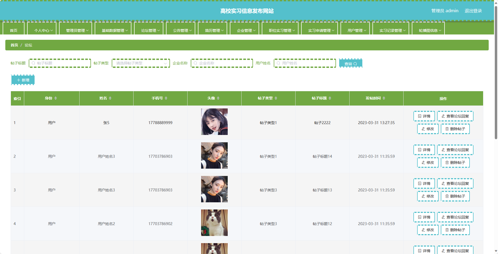
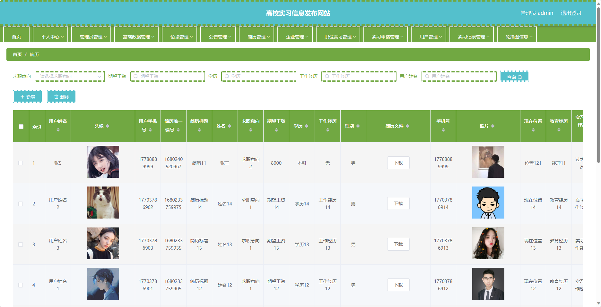

基于SpringBoot的高校实习信息发布网站（程序+论文）
=
- 完整代码获取地址：从戎源码网 ([https://armycodes.com/](https://armycodes.com/))
- 作者微信：19941326836  QQ：952045282 
- 承接计算机毕业设计、Java毕业设计、Python毕业设计、深度学习、机器学习
- 选题+开题报告+任务书+程序定制+安装调试+论文+答辩ppt 一条龙服务
- 所有选题地址https://github.com/nature924/allProject

一、项目介绍
---
基于Spring Boot框架实现的高校实习信息发布网站，系统包含三种角色：管理员、企业、用户,系统分为前台和后台两大模块，主要功能如下。
### 前台：

1. 首页：展示网站的概况、最新消息等。
2. 论坛：学生可以在论坛上发帖交流。
3. 公告：展示最新的通知、公告等信息。
4. 企业：展示合作的企业信息。
5. 职位实习：展示各类实习职位信息。
6. 个人中心：学生可以管理自己的个人信息。

### 后台：

1. 管理员个人中心：管理员可以管理个人信息，包括修改密码等操作。
2. 管理员管理：管理员可以管理其他管理员的信息，包括添加、编辑、删除等操作。
3. 基础数据管理：管理员可以管理学院、专业、班级等基础数据信息。
4. 论坛管理：管理员可以管理论坛上的帖子信息，包括审核、删除等操作。
5. 公告管理：管理员可以管理公告信息，包括添加、编辑、删除等操作。
6. 简历管理：管理员可以管理学生的简历信息，包括审核、删除等操作。
7. 企业管理：管理员可以管理企业信息，包括添加、编辑、删除等操作。
8. 职位实习管理：管理员可以管理职位实习信息，包括添加、编辑、删除等操作。
9. 实习申请管理：管理员可以管理学生的实习申请信息，包括审核、删除等操作。
10. 用户管理：管理员可以管理用户信息，包括添加、编辑、删除等操作。
11. 实习记录管理：管理员可以管理学生的实习记录信息，包括添加、编辑、删除等操作。
12. 轮播图信息：管理员可以管理网站首页的轮播图信息，包括添加、编辑、删除等操作。

### 企业：

1. 个人中心：企业可以管理自己的个人信息，包括修改密码等操作。
2. 论坛管理：企业可以在论坛上发帖交流。
3. 公告管理：企业可以发布公告信息。
4. 职位实习管理：企业可以发布职位实习信息。
5. 实习申请管理：企业可以管理学生的实习申请信息。

二、项目技术
---
- 编程语言：Java
- 数据库：MySQL
- 项目管理工具：Maven
- 前端技术：VUE、HTML、Jquery、Bootstrap
- 后端技术：Spring、SpringMVC、MyBatis

三、运行环境
---
- 操作系统：Windows、macOS都可以
- JDK版本：JDK1.8以上都可以
- 开发工具：IDEA、Ecplise、Myecplise都可以
- 数据库: MySQL5.7以上都可以
- Tomcat：任意版本都可以
- Maven：任意版本都可以

四、运行截图
---
### 论文截图：

### 程序截图：

